# High-Throughput Event-Driven Microservices E-Commerce Cluster

<p align="left">
  
  
  
  
  
  
</p>

A production-grade, highly resilient distributed system architected using Node.js, TypeScript, PostgreSQL, Redis, and RabbitMQ. The entire stack is containerized using multi-stage optimized Docker builds across isolated networks and instrumented with a full observability mesh utilizing OpenTelemetry, Jaeger, Prometheus, and Grafana.

---

## 🗺️ Architectural Topology & Event Mesh

```mermaid
flowchart TD

subgraph group_execution["Execution modes"]
  node_api_entrypoint["API entrypoint<br/>http runtime<br/>[api.ts]"]
  node_workers_entrypoint["Workers entrypoint<br/>consumer runtime<br/>[workers.ts]"]
  node_outbox_entrypoint["Outbox entrypoint<br/>relay runtime<br/>[outbox.ts]"]
end

subgraph group_domains["Domain modules"]
  node_users["Users<br/>feature module<br/>[user.routes.ts]"]
  node_products["Products<br/>feature module<br/>[product.routes.ts]"]
  node_cart["Cart<br/>feature module<br/>[cart.routes.ts]"]
  node_orders["Orders<br/>feature module<br/>[order.routes.ts]"]
  node_payments["Payments<br/>feature module<br/>[payment.routes.ts]"]
  node_notifications["Notifications<br/>async module"]
end

subgraph group_shared["Shared core"]
  node_server["Server<br/>http host<br/>[server.ts]"]
  node_auth_middleware["Auth guard<br/>middleware<br/>[auth.middleware.ts]"]
  node_db_pool[("Postgres pool<br/>sql persistence<br/>[pool.ts]")]
  node_redis[("Redis cache<br/>volatile state<br/>[redis.ts]")]
  node_queue["Message broker<br/>amqp broker<br/>[queue.ts]"]
  node_outbox_processor["Outbox relay<br/>event relay"]
  node_order_saga{{"Order saga<br/>orchestration<br/>[order.saga.ts]"}}
  node_metrics["Metrics<br/>telemetry<br/>[metrics.ts]"]
  node_tracer["Tracer<br/>telemetry<br/>[tracer.ts]"]
end

subgraph group_runtime["Deployment"]
  node_postgres[("PostgreSQL<br/>database service<br/>[docker-compose.yml]")]
  node_rabbitmq["RabbitMQ<br/>broker service<br/>[docker-compose.yml]"]
  node_redis_service[("Redis<br/>cache service<br/>[docker-compose.yml]")]
end

node_api_entrypoint -->|"starts"| node_server
node_server -->|"uses"| node_auth_middleware
node_server -->|"mounts"| node_users
node_server -->|"mounts"| node_products
node_server -->|"mounts"| node_cart
node_server -->|"mounts"| node_orders
node_server -->|"mounts"| node_payments
node_users -->|"persists"| node_db_pool
node_products -->|"reads"| node_db_pool
node_cart -->|"stores"| node_redis
node_cart -->|"persists"| node_db_pool
node_orders -->|"transacts"| node_db_pool
node_orders -->|"publishes"| node_queue
node_payments -->|"transacts"| node_db_pool
node_payments -->|"publishes"| node_queue
node_workers_entrypoint -->|"consumes"| node_queue
node_workers_entrypoint -->|"drives"| node_order_saga
node_order_saga -->|"coordinates"| node_orders
node_order_saga -->|"coordinates"| node_payments
node_order_saga -->|"triggers"| node_notifications
node_outbox_entrypoint -->|"runs"| node_outbox_processor
node_outbox_processor -->|"reads"| node_db_pool
node_outbox_processor -->|"publishes"| node_queue
node_metrics -->|"instruments"| node_server
node_tracer -->|"instruments"| node_server
node_tracer -->|"instruments"| node_workers_entrypoint
node_db_pool -->|"connects"| node_postgres
node_redis -->|"connects"| node_redis_service
node_queue -->|"connects"| node_rabbitmq

click node_api_entrypoint "https://github.com/nirodhauwanpriya/reactive-commerce-orchestrator/blob/master/src/entrypoints/api.ts"
click node_workers_entrypoint "https://github.com/nirodhauwanpriya/reactive-commerce-orchestrator/blob/master/src/entrypoints/workers.ts"
click node_outbox_entrypoint "https://github.com/nirodhauwanpriya/reactive-commerce-orchestrator/blob/master/src/entrypoints/outbox.ts"
click node_server "https://github.com/nirodhauwanpriya/reactive-commerce-orchestrator/blob/master/src/server.ts"
click node_auth_middleware "https://github.com/nirodhauwanpriya/reactive-commerce-orchestrator/blob/master/src/shared/middlewares/auth.middleware.ts"
click node_db_pool "https://github.com/nirodhauwanpriya/reactive-commerce-orchestrator/blob/master/src/shared/database/pool.ts"
click node_redis "https://github.com/nirodhauwanpriya/reactive-commerce-orchestrator/blob/master/src/shared/database/redis.ts"
click node_queue "https://github.com/nirodhauwanpriya/reactive-commerce-orchestrator/blob/master/src/shared/database/queue.ts"
click node_outbox_processor "https://github.com/nirodhauwanpriya/reactive-commerce-orchestrator/blob/master/src/shared/workers/outbox.processor.ts"
click node_order_saga "https://github.com/nirodhauwanpriya/reactive-commerce-orchestrator/blob/master/src/shared/saga/order.saga.ts"
click node_metrics "https://github.com/nirodhauwanpriya/reactive-commerce-orchestrator/blob/master/src/shared/monitoring/metrics.ts"
click node_tracer "https://github.com/nirodhauwanpriya/reactive-commerce-orchestrator/blob/master/src/shared/monitoring/tracer.ts"
click node_users "https://github.com/nirodhauwanpriya/reactive-commerce-orchestrator/blob/master/src/modules/users/user.routes.ts"
click node_products "https://github.com/nirodhauwanpriya/reactive-commerce-orchestrator/blob/master/src/modules/products/product.routes.ts"
click node_cart "https://github.com/nirodhauwanpriya/reactive-commerce-orchestrator/blob/master/src/modules/cart/cart.routes.ts"
click node_orders "https://github.com/nirodhauwanpriya/reactive-commerce-orchestrator/blob/master/src/modules/orders/order.routes.ts"
click node_payments "https://github.com/nirodhauwanpriya/reactive-commerce-orchestrator/blob/master/src/modules/payments/payment.routes.ts"
click node_notifications "https://github.com/nirodhauwanpriya/reactive-commerce-orchestrator/blob/master/src/modules/notifications/notification.worker.ts"
click node_postgres "https://github.com/nirodhauwanpriya/reactive-commerce-orchestrator/blob/master/docker-compose.yml"
click node_rabbitmq "https://github.com/nirodhauwanpriya/reactive-commerce-orchestrator/blob/master/docker-compose.yml"
click node_redis_service "https://github.com/nirodhauwanpriya/reactive-commerce-orchestrator/blob/master/docker-compose.yml"

classDef toneNeutral fill:#f8fafc,stroke:#334155,stroke-width:1.5px,color:#0f172a
classDef toneBlue fill:#dbeafe,stroke:#2563eb,stroke-width:1.5px,color:#172554
classDef toneAmber fill:#fef3c7,stroke:#d97706,stroke-width:1.5px,color:#78350f
classDef toneMint fill:#dcfce7,stroke:#16a34a,stroke-width:1.5px,color:#14532d
classDef toneRose fill:#ffe4e6,stroke:#e11d48,stroke-width:1.5px,color:#881337
classDef toneIndigo fill:#e0e7ff,stroke:#4f46e5,stroke-width:1.5px,color:#312e81
classDef toneTeal fill:#ccfbf1,stroke:#0f766e,stroke-width:1.5px,color:#134e4a
class node_api_entrypoint,node_workers_entrypoint,node_outbox_entrypoint toneBlue
class node_users,node_products,node_cart,node_orders,node_payments,node_notifications toneAmber
class node_server,node_auth_middleware,node_db_pool,node_redis,node_queue,node_outbox_processor,node_order_saga,node_metrics,node_tracer toneMint
class node_postgres,node_rabbitmq,node_redis_service toneRose
```



This platform uses asynchronous event-driven patterns to decouple frontend API traffic from heavy background transactional lifecycles.

```text
                                     [ REST Client ]
                                            │
                                 (HTTP POST /checkout)
                                            ▼
                               ┌─────────────────────────┐
                               │   API Gateway Service   │ ──► [ Redis Cache ]
                               └─────────────────────────┘      (Cart Storage)
                                            │
                                 (ACID Transaction Block)
                                            ▼
                        ┌───────────────────────────────────────┐
                        │   PostgreSQL DB Engine (Port 5433)    │
                        │ ┌───────────────────┐ ──────────────┐ │
                        │ │ Ledger Data Table │ │ Outbox Table │ │
                        │ └───────────────────┘ ──────────────┘ │
                        └───────────────────────────────────────┐
                                                   │
                                            (Polling Sweep)
                                                   ▼
                               ┌─────────────────────────┐
                               │  Outbox Relay Service   │
                               └─────────────────────────┘
                                            │
                                     (AMQP Protocol)
                                            ▼
                               ┌─────────────────────────┐
                               │ RabbitMQ Event Broker   │
                               └─────────────────────────┘
                                            │
                    ┌───────────────────────┴───────────────────────┐
                    ▼                                               ▼
       [ notification_service_queue ]               [ order_saga_orchestrator_queue ]
                    │                                               │
       ┌─────────────────────────┐                     ┌─────────────────────────┐
       │   Notification Worker   │                     │    Saga Orchestrator    │
       └─────────────────────────┘                     └─────────────────────────┘
                                                                    │
                                                      (Command / Rollback Pipelines)
                                                                    ▼
                                                       ┌─────────────────────────┐
                                                       │  Payment / Inventory    │
                                                       └─────────────────────────┘

```

---

## 🚀 Deep-Dive into Core Distributed Patterns Implemented

### 1. The Transactional Outbox Pattern

* **The Problem:** In standard microservice designs, updating a database state and immediately emitting an event to a message broker introduces the **Dual-Write Problem**. If the database transaction commits successfully, but a transient network failure drops the connection to the message broker right after, downstream services never receive the event. The system falls into a corrupted, inconsistent state.
* **The Solution:** We enforce atomic consistency by writing both the business data (the `orders` ledger) and the event notification payload (`OrderCreated`) into the **same physical PostgreSQL ACID transaction block**.
* **The Mechanics:** An independent, asynchronous `outbox-relay` background worker continuously polls the `outbox` table using a high-frequency polling sweep. The moment it successfully streams the event payload over the virtual network using the AMQP protocol to RabbitMQ, it deletes or flags the row. If the broker dies mid-transit, the event remains securely safely on disk, guaranteeing **At-Least-Once Delivery**.

### 2. Orchestrated Saga State Machine (Distributed Transactions)

* **The Problem:** Because each microservice controls its own isolated, decoupled database network boundary, traditional database-level locking mechanics like Two-Phase Commit (2PC) are unusable. They cause massive blocking latency and fail completely if a single network node drops offline.
* **The Solution:** Implemented an asynchronous **Orchestrated Saga Pattern** driven by a centralized state machine. The orchestrator listens to event streams on dedicated RabbitMQ queues to drive the business lifecycle forward.
* **The Mechanics:** If a downstream service executes flawlessly, the Saga marks the instance `COMPLETED`. However, if the `payment-worker` catches a credit card bank rejection, the orchestrator instantly catches the `PaymentFailed` payload and executes a series of **Compensating Transactions**—broadcasting explicit commands across the internal network to restock item counts in the inventory module, invalidate stale caches, and flag the ledger record as `CANCELLED`.

### 3. High-Performance Cache-Aside Engine

* Volatile, high-frequency read/write operations (like individual user shopping carts) completely bypass persistent storage disks and live inside a specialized **Redis Cache** layout.
* To guarantee strict data isolation and consistency, successful Saga conclusions or rollback sequences trigger programmatic cache invalidation routines immediately, ensuring the high-speed RAM layer remains aligned with the source-of-truth PostgreSQL disk engine.

---

## 📊 Full Observability & Telemetry Mesh

True microservices cannot rely on terminal logs or standard standard console printouts. This cluster features complete distributed instrumentation across both metrics and traces.

### 1. Prometheus Metrics Monitoring (System Vital Signs)

Every decoupled runtime service exposes a dedicated `/metrics` network route powered by `prom-client` that is scraped by our Prometheus time-series database engine every 5 seconds.

* **Infrastructure Telemetry:** Real-time diagnostics tracking Node.js V8 runtime engine heap memory allocation counters, event-loop lag saturation metrics, garbage collection duration percentiles, and open file descriptor limits.
* **Domain KPI Telemetry:** Built custom multi-label metrics (`ecommerce_saga_outcome_total{status, reason}`) to track the concrete volume of successful checkouts versus transactions rejected due to insufficient funds or security risks.
* **Visualization Layer:** Integrated a centralized **Grafana dashboard** mapping system resources alongside business KPIs to give complete visibility into cluster performance under load.

### 2. OpenTelemetry & Jaeger Distributed Tracing

* Implemented systemic context propagation across isolated service boundaries using the **OpenTelemetry Node SDK**.
* Every single request entering the `api-gateway` edge boundary is instantly stamped with a unique, immutable `trace_id`.
* This token propagates across network hops, traveling inside PostgreSQL SQL pool queries, Redis data lookups, and RabbitMQ AMQP message header metadata blocks.
* **Jaeger Timelines:** Connects directly into the OpenTelemetry collection collector port to render comprehensive waterfall visualization maps, showing the exact duration in milliseconds that a request spent inside *every single isolated query and internal function call*.

---

## 🧪 Chaos Engineering & Resiliency Simulation

To prove the production-grade fault tolerance of our self-healing design, the live cluster architecture was subjected to a rigorous **Infrastructure Severance Simulation**:

```powershell
# 1. Fire a live checkout transaction payload through the API Gateway Edge
$loginResponse = Invoke-RestMethod -Uri "http://localhost:3000/api/users/login" -Method POST -Body '{"email": "terminaluser@example.com", "password": "securepass123"}' -ContentType "application/json"
$token = $loginResponse.token
$cartBody = @{productId=1; quantity=1} | ConvertTo-Json
Invoke-RestMethod -Uri "http://localhost:3000/api/cart/add" -Method POST -Body $cartBody -ContentType "application/json" -Headers @{Authorization = "Bearer $token"}

Invoke-RestMethod -Uri "http://localhost:3000/api/orders/checkout" -Method POST -Headers @{Authorization = "Bearer $token"} | ConvertTo-Json

# 2. IMMEDIATELY CRASH THE RABBITMQ EVENT BROKER CONTAINER MID-TRANSACTION!
docker-compose stop rabbitmq

```

### 📈 Verified Failure Recovery Outcomes

* **Zero Customer Impact:** The `api-gateway` process handled the infrastructure failure flawlessly, committing the transactional state securely to the local PostgreSQL database pool before immediately returning a clean `202 PENDING` code block to the terminal client.
* **Backlog Isolation:** The `outbox-relay` container automatically caught the broken connection, gracefully entered a safe retry backoff loop, and held all transaction event records safely inside durable storage without losing a single data packet.
* **Automated Re-Sync:** The exact moment the broker container was brought back online (`docker-compose start rabbitmq`), the self-healing retry logic automatically re-established the AMQP network channel, cleared the historical outbox database ledger, and successfully processed the delayed Saga workflows.

---

## 🛠️ Local Infrastructure Deployment & Setup

### Prerequisites

* Ensure you have [Docker Desktop](https://www.docker.com/products/docker-desktop/) installed and actively running.
* Windows PowerShell, Command Prompt, or a native Bash terminal environment.

### 1. Boot up the entire 8-Container Mesh

Run the following build script at the root directory of the project. Docker will process the multi-stage build optimization configurations, prune development modules, compile the TypeScript source trees, and organize the virtual subnets:

```powershell
docker-compose up --build -d

```

### 2. Verify Container Synchronizations

Ensure all isolated network boundaries are active and communicating properly across the virtual network bridge:

```powershell
docker ps

```

### 3. Port Mapping Interface Reference Guide

You can query, monitor, and interact with every microservice layer and monitoring engine directly from your host machine browser environment:

| Service UI Component | Host Machine URL | Purpose |
| --- | --- | --- |
| **API Gateway Core** | `http://localhost:3000` | Synchronous Express REST Router Endpoints |
| **Grafana UI Dashboard** | `http://localhost:3001` | Visual Time-Series Metric Dashboards |
| **Jaeger Tracing Interface** | `http://localhost:16686` | Distributed Tracing Latency Timelines |
| **Prometheus Telemetry Engine** | `http://localhost:9090` | Time-Series Target Scraping Health Status |
| **RabbitMQ Management Dashboard** | `http://localhost:15672` | Real-time Message Broker Queue Monitors |
| **Saga Worker Telemetry Channel** | `http://localhost:3002/metrics` | Raw Asynchronous Worker Metric Streams |

```
